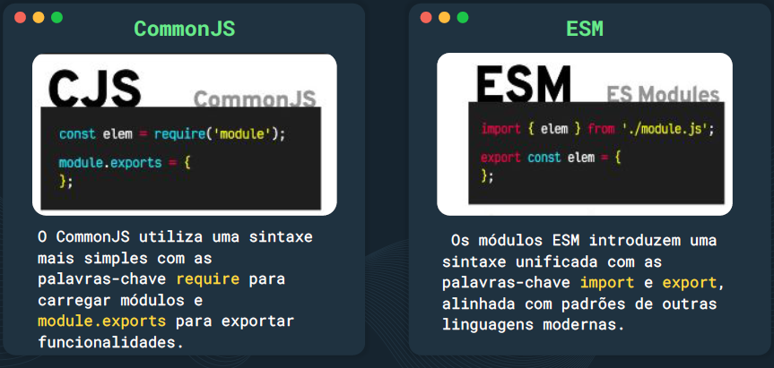
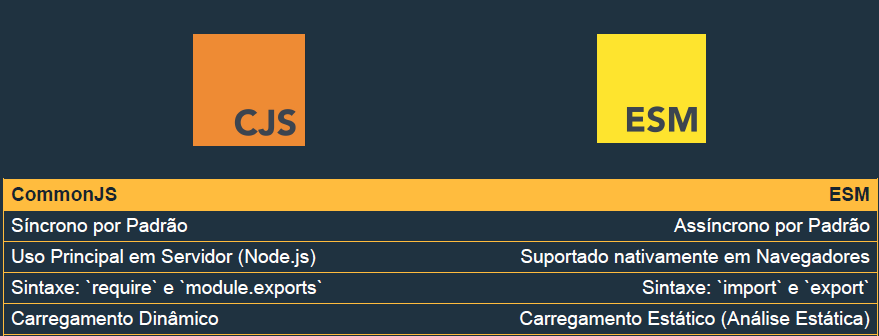

# NODE.JS  Modules

## Qual o Problema?

* Códigos tendem a ser Monstrinhos.
* É normal ter muitas pessoas editando o mesmo código

## PORQUE MODULARIZAR?

* código vai se tornando complexo
* difícil de dar manutenção
* difícil de fazer mudança
* Um código, dividido em pequenos arquivos

## TIPOS DE MÓDULOS

## DIFERENÇA

